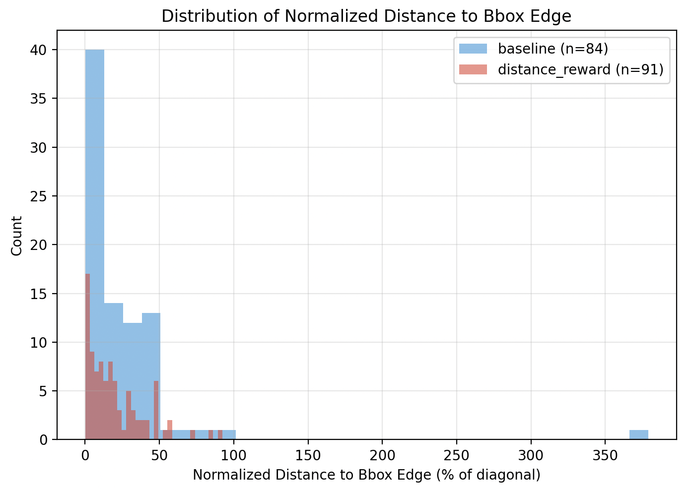

  <h1>GTA1: GUI Test-time Scaling Agent</h1> 

Exploring some code for my 2025 winter break, christmas, and new year! Merry Christmas and Happy New Year!

I originally forked this project from https://github.com/Yan98/GTA1 — please take a moment to check out the original repo and give it an upvote! Thanks GTA1 for making this repo open-source. 

## TL;DR

  
I spent $230 on Lambda compute (most of it went into setting up the environment and debugging things I thought were easy to debug 😭) to run a very *very* small experiment.  
I trained Qwen2.5-VL-3B-Instruct with the GTA1 training code on *only* 8 examples from the Aria-UI dataset they used (originally wanted to do 100 examples but it would take too long and compute was expensive).  
I evaluated on 100 random ScreenSpot Pro examples.

I also tested with my implementation of the [GroundCUA](https://github.com/ServiceNow/GroundCUA) reward function trained on the same 8 examples. 

wandb project: https://wandb.ai/vincenttu/gta1
HF repo: https://huggingface.co/alckasoc/mini-gta1-3b

### Findings

This experiment is way too small to make any sense out of, but we can speculate. 

I included epoch step 80 because it had the highest reward. 

| Model/Setting              | # Correct |
|----------------------------|-----------|
| base model                 | 5         |
| baseline (80 epochs in)    | 15        |
| baseline (100 epochs)      | 16        |
| distance reward (80 epochs)| 8         |
| distance reward (100 epochs)| 9        |

- from the reward plots, the slope of both rewards is roughly the same ~0.007-0.008 of reward per step; both show a strong upward trend but very choppy and slow 
- the GroundCUA reward function has a larger reward range and starts lower, heavily penalizing far-off points and continually optimizing points within the bbox till it reaches the center (whereas the hit reward just checks if the point is in the box)
- the hit reward achieves more correct much sooner in training; it seems the distance (GroundCUA) reward is about twice as slow in achieving the same performance (but it could also be that I implemented it incorrectly)

#### Correct Examples & Error Analysis

I took a quick look on both the 100 epoch baseline and 100 epoch distance reward and they share **8** correct examples, which leads me to think these 8 evaluation examples are easy. Coordinate placement for the correct examples are pretty much the same. In both evaluation results, mac had the most correct by an overwhelming majority. Maybe these models have strong Mac understanding? And/or the buttons are bigger/wider?
 
There were no formatting issues for either run (baseline/distance reward 100 epochs). I didn't look at all the incorrect examples for both of the 2 runs. 

They have similar distribution of distance from predicted to bbox edge except the baseline has an outlier, skewing the std and mean. Both have similar values (below) otherwise. The outlier had these stats:

- Raw Distance: 13367.8px
- Image size: 2992x1870, Diagonal: 3528.3px
- NORMALIZED Distance: 378.9% of diagonal
- Prompt: exit fullscreen
- Image: screenshot_2024-10-23_11-32-54.png
- Pred: (2405, 13215)
- Bbox: [49, 37, 66, 53]
- Raw response: (2408,13257)

It was way off! Larger screens will make icons much smaller and thus harder I'm guessing.

| Metric                              | Baseline | Dist Reward |
|--------------------------------------|----------|-------------|
| Mean normalized dist to edge (%)     |   25.38  |    20.02    |
| Median normalized dist to edge (%)   |   14.62  |    14.58    |
| Std normalized dist to edge (%)      |   43.70  |    19.24    |
| % within 5% of diagonal             |   27.38  |    24.18    |
| % within 10% of diagonal            |   44.05  |    40.66    |
| % within 20% of diagonal            |   55.95  |    62.64    |

I had a lot of fun learning and training a mini grounding model. Though there's no clear conclusion from this, it was interesting to see how the 2 reward functions compared! Thanks for viewing! 👋